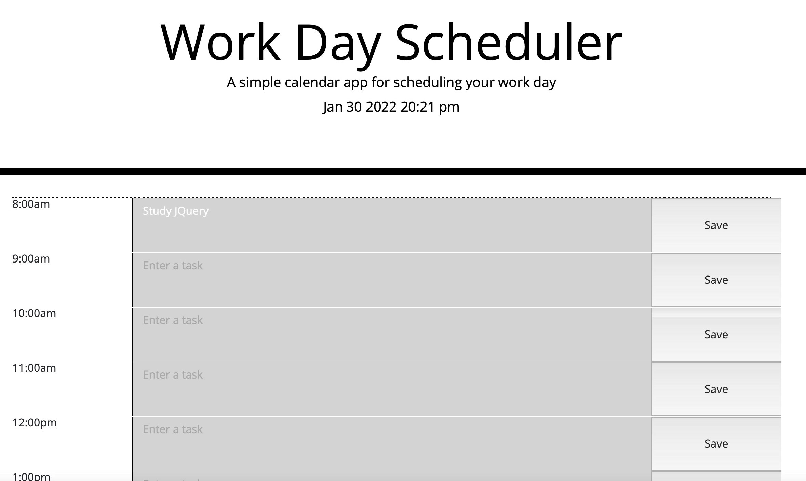

# Work Day Scheduler

## Description

This is a repository of my daily task planner project.

This task planner was created to help the user stay organized and keep track of the various tasks they need to complete throughout the day.

    Features included in the planner:

    - Tasks can be edited or deleted.
    - Tasks are saved to the browser's local storage, so they will persit even if the broswer if closed or refreshed.
    - The task time blocks are colored-coded, to indictae whether a task is in the past, present, or future.

## Installation

Nothing special is required to get this development environment running.

## Technologies

1. HTML 5
2. CSS 3
3. Bootstrap
4. Javascript
5. JQuery

## Usage

You can find the portfolio landing page deployed [here](https://prgottinger.github.io/work-day-scheduler/).

## License

MIT License

Copyright (c) [2021] [PR Gottinger]

Permission is hereby granted, free of charge, to any person obtaining a copy
of this software and associated documentation files (the "Software"), to deal
in the Software without restriction, including without limitation the rights
to use, copy, modify, merge, publish, distribute, sublicense, and/or sell
copies of the Software, and to permit persons to whom the Software is
furnished to do so, subject to the following conditions:

The above copyright notice and this permission notice shall be included in all
copies or substantial portions of the Software.

THE SOFTWARE IS PROVIDED "AS IS", WITHOUT WARRANTY OF ANY KIND, EXPRESS OR
IMPLIED, INCLUDING BUT NOT LIMITED TO THE WARRANTIES OF MERCHANTABILITY,
FITNESS FOR A PARTICULAR PURPOSE AND NONINFRINGEMENT. IN NO EVENT SHALL THE
AUTHORS OR COPYRIGHT HOLDERS BE LIABLE FOR ANY CLAIM, DAMAGES OR OTHER
LIABILITY, WHETHER IN AN ACTION OF CONTRACT, TORT OR OTHERWISE, ARISING FROM,
OUT OF OR IN CONNECTION WITH THE SOFTWARE OR THE USE OR OTHER DEALINGS IN THE
SOFTWARE.
